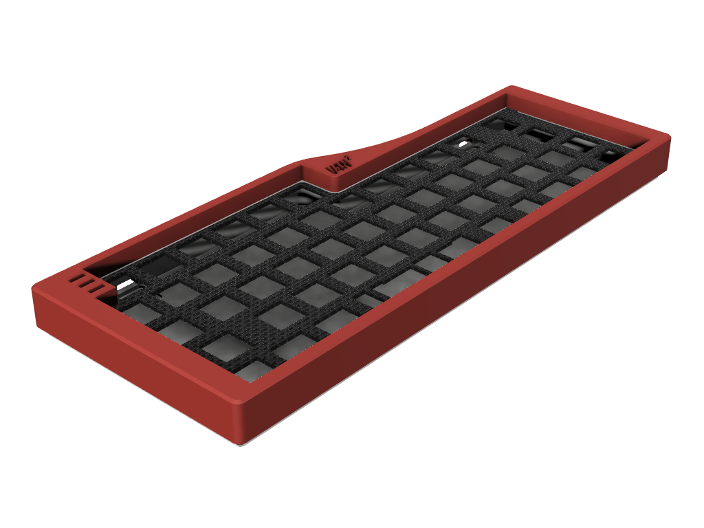
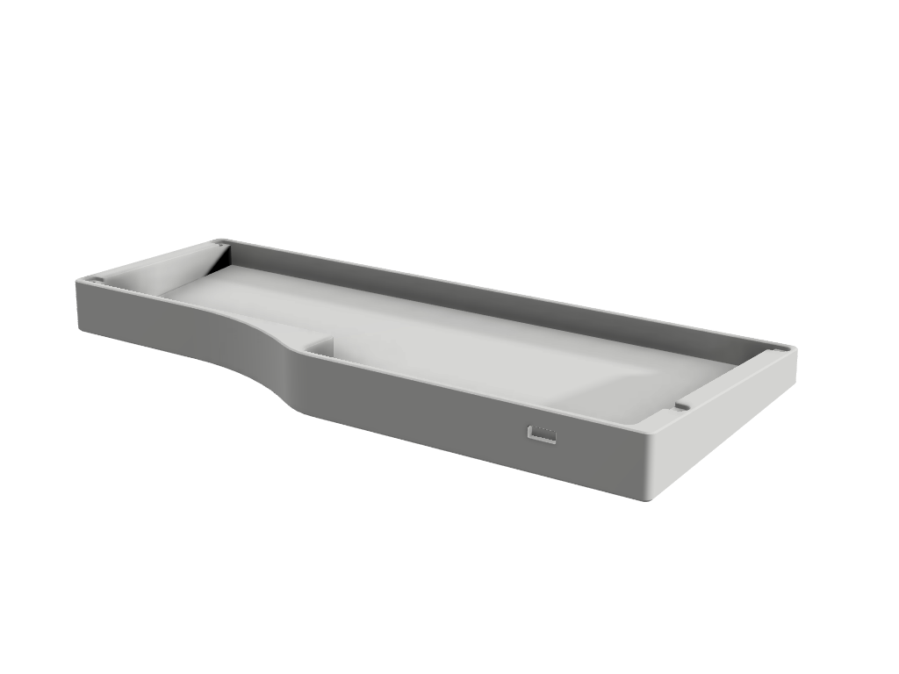
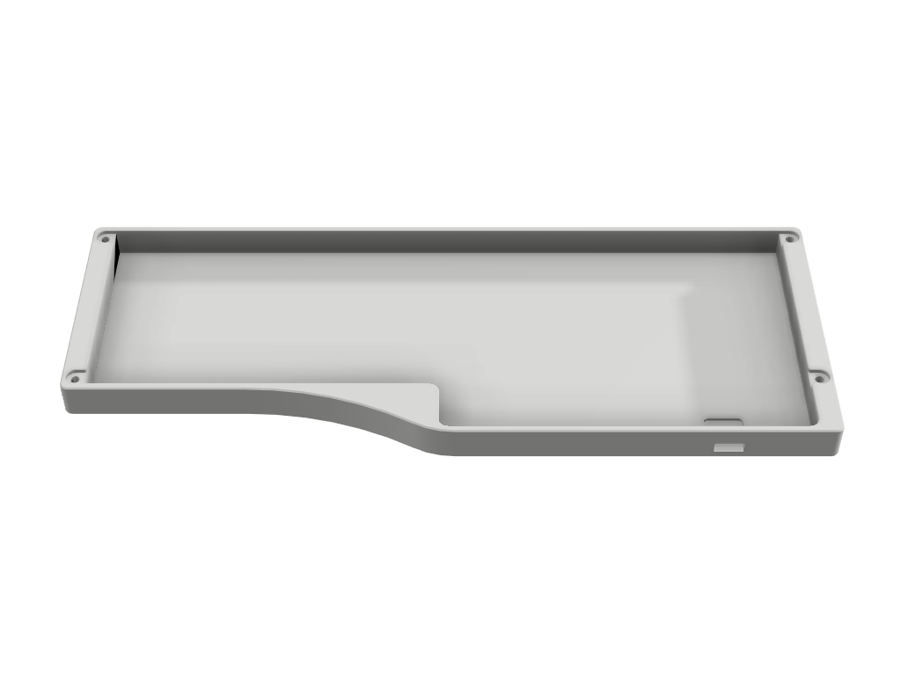
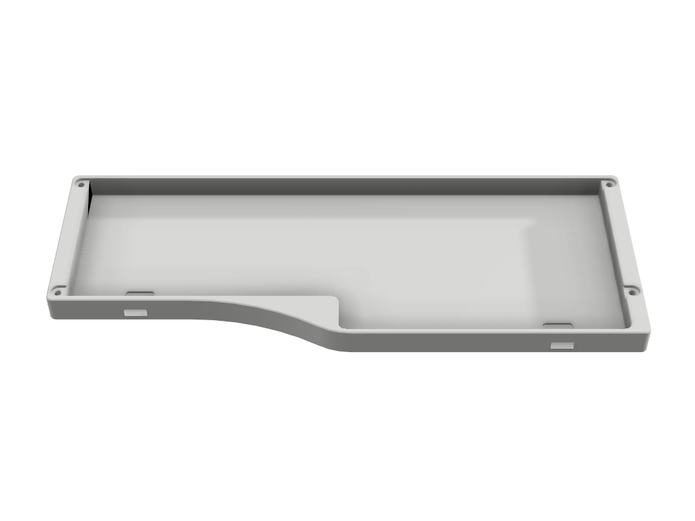
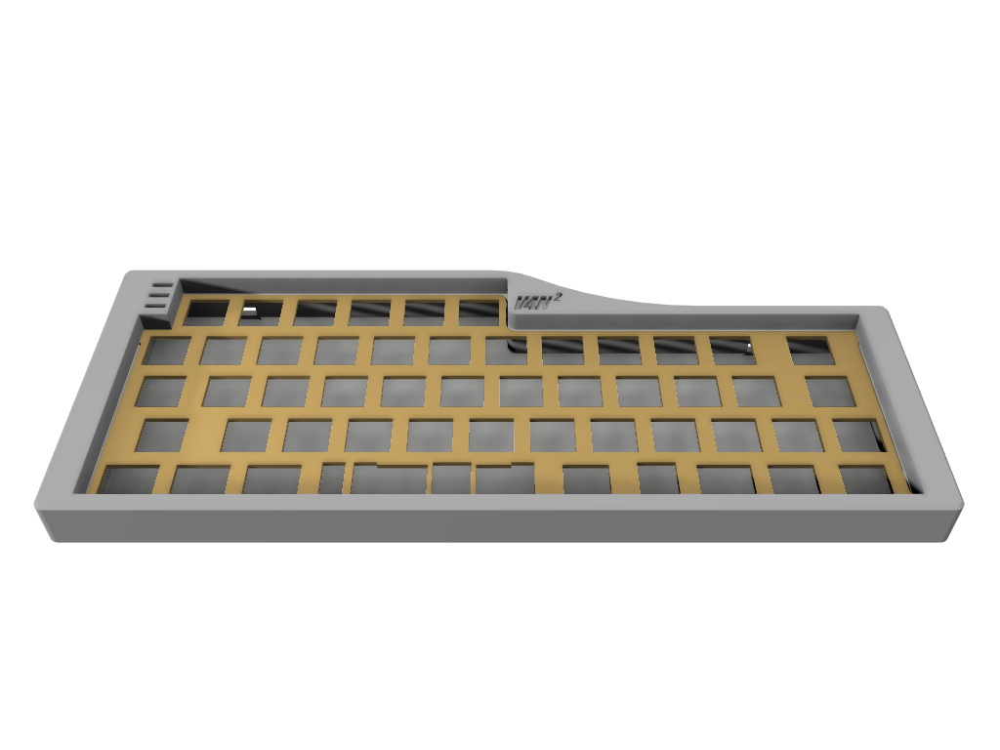
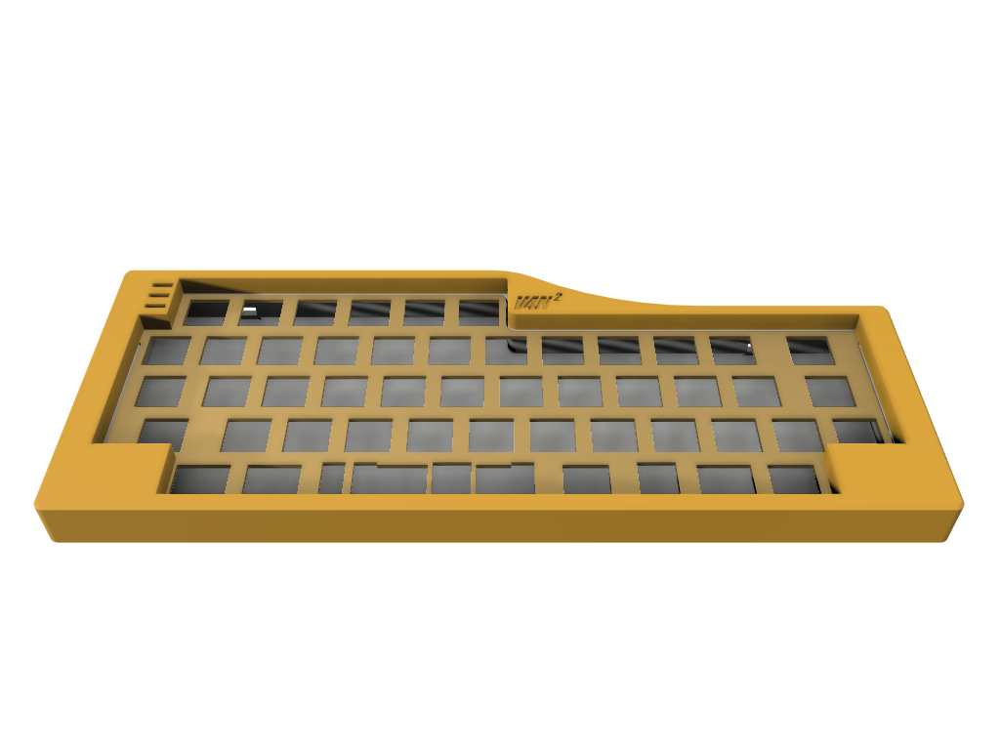
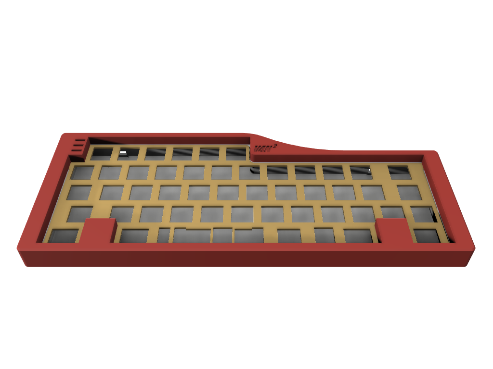

# V4N2

 

V4N2 is a case for [V4N4G0N](https://trashman.wiki/keyboards/v4n4g0n)-compatible PCBs. Originally designed for [Monorail](https://trashman.wiki/en/community/pcbs/monorail) which has 2 USB ports (only 1 is usable at a time, **do not plug both ports at the same time**), hence the 2 name.

V4N2 utilizes [Hullagon aka. R3 V4N4G0N plate](https://trashman.wiki/en/files#v4n4g0n) and mounting. The bottom part can be used without the top part as a low profile case.

## Variants

The bottom part has 2 variants: Angled (5&deg;) and Flat.
Both variants are compatible with all V4N4G0N PCBs. There are 2 versions for each variants: single and dual USB ports.

| Single port | Dual Port |
| --- | --- |
|  |  |
|  |  |

The top part has 3 variants:

### Universal

No blocker.

### HHKB

HHKB-style blocker with symmetrical 1.25u blockers on the left and right corner.

### WKL

WKL-style blocker with symmetrical 1u blockers on the left and right side.

## Compatibility

| Compatible PCBs | Bottom | Top |
| --- | --- | --- |
| V4N4G0N R1/2/3 | <ul><li>Angled single port</li><li>Flat single port</li> | Universal |
| Monorail | <ul><li>Angled single port</li><li>Angled dual ports</li><li>Flat single port</li><li>Flat dual poorts</li></ul> | Universal |
| Monorail Steam | <ul><li>Angled single port</li><li>Angled dual ports</li><li>Flat single port</li><li>Flat dual poorts</li></ul> | <ul><li>Universal</li><li>HHKB</li><li>WKL</li></ul> |

## Notes

This case is released with MIT License, so feel free to modify, extend or integrate them. As per license, there will be no warranty or liability related to these cases.

If you like this case and find it useful, you can [buy me a coffee](https://www.buymeacoffee.com/coffeeforba).
