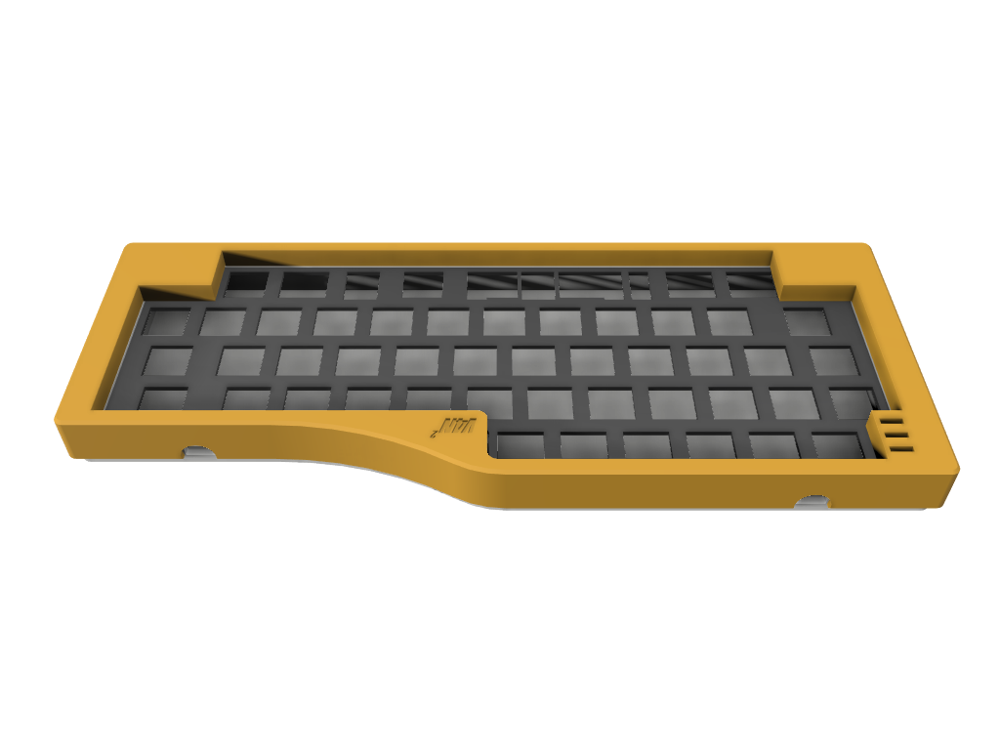

# V4N2

V4N2 is a case for V4N4G0N-compatible PCBs. Specifically designed for Monorail which has 2 USB ports (only 1 is usable at a time), hence the name.

V4N2 utilizes Hullagon plate and mounting. The bottom part can be use as a low profile case without the top part.

The bottom part has 2 variants: Angled (5&deg;) and Flat. Both variants are compatible with all V4N4G0N PCBs.

The top part has 3 variants:
* Universal. No blocker and compatible with all V4N4G0N PCBs.
* HHKB. HHKB-style blocker with symmetrical 1.25u blockers on the left and right corner. Only compatible with Monorail Steam PCB.
* WKL. WKL-style blocker with symmetrical 1u blockers on the left and right side. Only compatible with Monorail Steam PCB.
